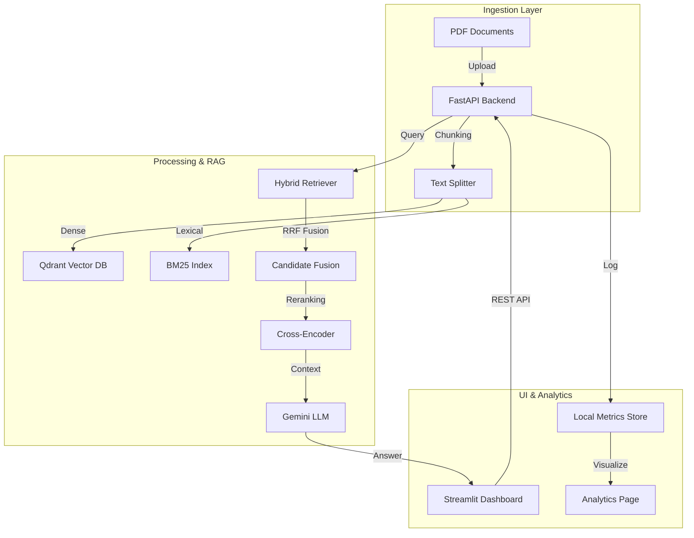

<div align="center">

  # 🧠 InvenioAI — Document Q&A (RAG) + Analytics
  **Hybrid RAG Pipeline, Semantic Search, and Multi-Document Intelligence.**
  
  [](https://fastapi.tiangolo.com/)
  [](https://streamlit.io/)
  [](https://langchain.com/)
  [](https://qdrant.tech/)
  [](https://aistudio.google.com/)
  [](https://www.python.org/)
</div>

---

## Overview

In the era of information density, extracting precise answers from large PDF collections is critical. **InvenioAI** is a high-performance **Document Q&A system** that implements a state-of-the-art **Hybrid RAG pipeline**.

It transforms static PDF documents into a searchable, intelligent knowledge base, allowing users to ask complex questions and receive answers grounded in retrieved context with verifiable source citations.

## Live Demo

- **Hugging Face Space**: [https://felixhrdyn-invenioai.hf.space](https://felixhrdyn-invenioai.hf.space)

## Technical Features

- **Hybrid RAG Pipeline**: Combines dense semantic retrieval (MultiQuery + MMR) with lexical BM25 search, fused via weighted Reciprocal Rank Fusion (RRF).
- **Advanced Reranking**: Utilizes Cross-Encoder models to re-evaluate top candidates, ensuring the most relevant context is provided to the LLM.
- **Async Job Orchestration**: Background indexing and query execution with real-time status polling for a smooth user experience.
- **Deep Analytics Dashboard**: Built-in metrics tracking for retrieval accuracy (nDCG, HitRate), latency, and API usage.
- **Cloud-Ready Architecture**: Ships with an all-in-one Docker configuration optimized for Hugging Face Spaces and Azure Container Apps.
- **Flexible UI**: Premium Streamlit interface featuring a custom design system, glassmorphism aesthetics, and interactive chat history.

## Technology Stack

### Backend
- **Framework**: FastAPI
- **RAG Engine**: LangChain
- **Models**: Google Gemini 3.1 Flash Lite Preview, all-MiniLM-L6-v2 (Local Embedding)
- **Reranker**: Cross-Encoder (MS-MARCO MiniLM)
- **Search**: BM25 (Lexical) + Qdrant (Dense)

### Frontend
- **Framework**: Streamlit
- **Visualization**: Plotly, Pandas
- **Styling**: Vanilla CSS (Custom Design System)
- **Icons**: Lucide (SVG)

### Infrastructure
- **Vector Database**: Qdrant (Local / Server / Cloud)
- **Deployment**: Docker, GitHub Actions (CI/CD)
- **Environment**: Python 3.10+

## System Architecture



---

## Performance & Limits

InvenioAI is optimized for speed and retrieval precision while maintaining low operational costs.

### Core Metrics & Operational Limits
| Parameter | Value | Description |
| :--- | :--- | :--- |
| **Retrieval Mode** | **Hybrid** | Dense (MMR) + Lexical (BM25) |
| **Fusion Limit** | **Top 20** | Candidates kept after RRF fusion |
| **QA Latency** | **~10-15s** | Average end-to-end response time |
| **Indexing Speed** | **~32 chunks/batch** | Optimized for memory-constrained runtimes |

---

## Deployment Guide

### Prerequisites
*   Python 3.10+
*   Google Gemini API Key
*   Qdrant Instance (Optional, defaults to local storage)

### Execution Procedures

**Step 1: Environment Setup**
```bash
python -m venv venv
source venv/bin/activate  # venv\Scripts\activate on Windows
pip install -r requirements.txt
cp .env.example .env
```

**Step 2: Run Application**
```bash
# Terminal 1: Backend API
uvicorn app.main:app --reload

# Terminal 2: Streamlit UI
streamlit run frontend/streamlit_app.py
```

**Step 3: Docker (Production)**
```bash
docker build -t invenioai .
docker run -p 7860:7860 invenioai
```

---

## Configuration

The application is configured via `.env`. Key variables include:
- `GEMINI_API_KEY`: Required for LLM and Query Rewriting.
- `QDRANT_URL`: Optional server URL (defaults to local `./qdrant_storage`).
- `INVENIOAI_ENABLE_HYBRID_SEARCH`: Toggle dense+lexical mode (Default: `1`).
- `INVENIOAI_DELETE_UPLOADED_PDFS`: Clean up storage after indexing (Default: `0`).

---

## Author

**Felix Hardyan**
*   [GitHub](https://github.com/flxhrdyn)
*   [Hugging Face](https://huggingface.co/felixhrdyn)
